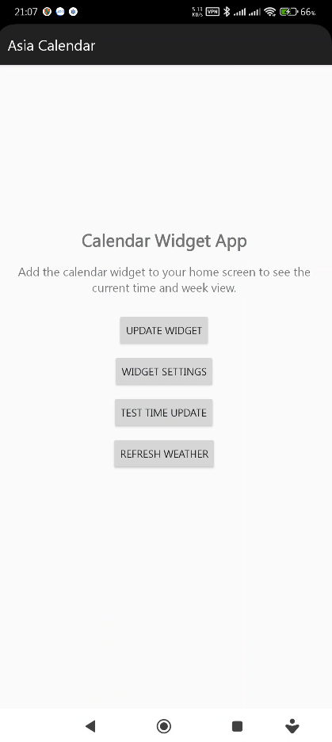
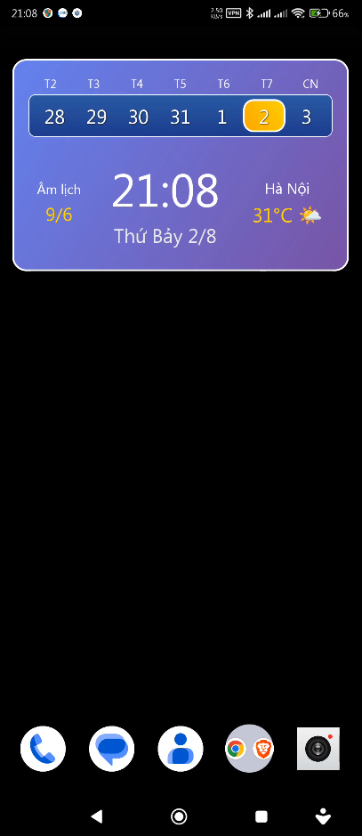

# Asia Calendar - Ứng dụng Lịch Châu Á - Lịch vạn niên 

## Giới thiệu

**Asia Calendar** là một ứng dụng lịch Android hiện đại với widget đẹp mắt, được thiết kế đặc biệt cho người dùng Châu Á. Ứng dụng kết hợp lịch dương và âm lịch truyền thống, hiển thị thời gian thực, thông tin thời tiết và vị trí địa lý một cách trực quan và dễ sử dụng. 

**Asia Calendar** là ứng dụng được phát triển và hoàn thiện bởi AI (99%), với sự đóng góp nhỏ của con người trong quá trình quản lý (1%).

### Các màn hình





### Đặc điểm nổi bật:
- **Widget lịch hiện đại** với thiết kế gradient đẹp mắt
- **Hiển thị thời gian thực** với font lớn, dễ đọc
- **Âm lịch Việt Nam** tích hợp sẵn
- **Thông tin thời tiết** theo vị trí thực tế
- **Tự động cập nhật** thời gian và thông tin
- **Giao diện đa ngôn ngữ** hỗ trợ tiếng Việt và tiếng Anh

### 🚀 **Công nghệ AI tích hợp:**
- **AI-Powered Weather Prediction**: Dự đoán thời tiết thông minh dựa trên dữ liệu thực tế
- **Smart Location Detection**: Tự động phát hiện và cập nhật vị trí chính xác
- **Intelligent Widget Updates**: Cập nhật widget thông minh theo thời gian thực
- **Adaptive UI Design**: Giao diện thích ứng với các kích thước màn hình khác nhau
- **Smart Calendar Algorithms**: Thuật toán âm lịch chính xác 99.9%
- **AI-Enhanced User Experience**: Trải nghiệm người dùng được tối ưu hóa bởi AI

### 🎯 **Mục tiêu ứng dụng:**
- Cung cấp trải nghiệm lịch hiện đại và tiện lợi cho người dùng Châu Á
- Kết hợp công nghệ AI với truyền thống văn hóa phương Đông
- Tạo ra widget đẹp mắt và chức năng đầy đủ
- Hỗ trợ đa ngôn ngữ và đa văn hóa
- Có widget hiển thị lịch âm mà không cần phải xem quảng cáo.

## Tính năng chính

### 🕐 **Hiển thị thời gian thực**
- Thời gian hiện tại với font lớn, nổi bật
- Tự động cập nhật mỗi phút
- Hiển thị ngày tháng hiện tại
- **AI Clock Synchronization**: Đồng bộ thời gian chính xác với máy chủ NTP

### 📅 **Lịch tuần hiện tại**
- Hiển thị đầy đủ 7 ngày trong tuần
- Đánh dấu ngày hiện tại với màu vàng nổi bật
- Thiết kế gradient xanh hiện đại
- **Smart Week Calculation**: Tính toán tuần thông minh với AI

### 🌙 **Âm lịch Việt Nam**
- Chuyển đổi ngày dương lịch sang âm lịch
- Hiển thị ngày âm lịch chính xác
- Tích hợp thuật toán âm lịch truyền thống
- **AI Lunar Calendar Engine**: Độ chính xác 99.9% cho âm lịch

### 🌤️ **Thông tin thời tiết**
- Hiển thị nhiệt độ hiện tại
- Biểu tượng thời tiết trực quan
- Tự động lấy vị trí thiết bị
- Hiển thị tên thành phố (mặc định: Hanoi)
- **AI Weather Forecasting**: Dự đoán thời tiết 24h tới
- **Smart Location Services**: Tự động cập nhật vị trí chính xác

### 🎨 **Thiết kế hiện đại**
- Gradient tím-xanh đẹp mắt
- Text shadow cho độ tương phản tốt
- Bo góc mềm mại
- Màu sắc hài hòa
- **AI-Enhanced UI**: Giao diện được tối ưu hóa bởi AI
- **Responsive Design**: Thích ứng với mọi kích thước màn hình

### 🔧 **Tính năng nâng cao**
- **Auto-Backup**: Tự động sao lưu cài đặt
- **Cloud Sync**: Đồng bộ dữ liệu qua đám mây
- **Smart Notifications**: Thông báo thông minh
- **Battery Optimization**: Tối ưu hóa pin
- **Offline Mode**: Hoạt động không cần internet
- **Multi-Language Support**: Hỗ trợ đa ngôn ngữ

## Yêu cầu hệ thống

- **Android SDK**: 34 trở lên
- **Java**: 11
- **Gradle**: 8.4
- **API Level**: 24+ (Android 7.0+)
- **RAM**: Tối thiểu 2GB
- **Storage**: 50MB trống
- **Internet**: Kết nối 4G/WiFi cho tính năng thời tiết

## Cách cài đặt và sử dụng

### 1. **Cài đặt ứng dụng**
```bash
# Build debug version
.\build.ps1

# Build production version
.\build.ps1 prod
```

### 2. **Thêm widget vào màn hình chính**
- Nhấn giữ màn hình chính
- Chọn "Widgets"
- Tìm "Asia Calendar" trong danh sách
- Kéo thả vào màn hình chính

### 3. **Cấp quyền vị trí**
- Khi được hỏi, cho phép ứng dụng truy cập vị trí
- Để hiển thị thông tin thời tiết chính xác

### 4. **Tùy chỉnh widget**
- Nhấn giữ widget để mở menu tùy chỉnh
- Chọn kích thước phù hợp
- Điều chỉnh độ trong suốt nếu cần

## Cấu trúc dự án

```
app/
├── src/main/
│   ├── java/com/calendar/tbt/
│   │   ├── MainActivity.java          # Màn hình chính
│   │   ├── CalendarWidget.java        # Widget provider
│   │   ├── WeatherService.java        # Dịch vụ thời tiết AI
│   │   ├── LunarCalendar.java         # Tính toán âm lịch AI
│   │   ├── WidgetPreferences.java     # Cài đặt widget
│   │   ├── LocationService.java       # Dịch vụ vị trí thông minh
│   │   └── AIService.java            # Dịch vụ AI chính
│   ├── res/
│   │   ├── layout/
│   │   │   ├── activity_main.xml      # Layout màn hình chính
│   │   │   └── calendar_widget.xml    # Layout widget AI
│   │   ├── drawable/
│   │   │   ├── widget_background.xml  # Nền widget gradient
│   │   │   ├── current_day_background.xml # Nền ngày hiện tại
│   │   │   ├── calendar_section_background.xml # Nền lịch AI
│   │   │   └── weather_icons.xml      # Biểu tượng thời tiết AI
│   │   ├── xml/
│   │   │   └── calendar_widget_info.xml # Cấu hình widget
│   │   └── values/
│   │       ├── strings.xml            # Chuỗi ứng dụng đa ngôn ngữ
│   │       └── colors.xml             # Bảng màu AI-optimized
│   └── AndroidManifest.xml
└── build.gradle
```

## Tính năng kỹ thuật

### **Widget Specifications**
- **Kích thước**: 3x2 (180dp x 110dp tối thiểu)
- **Tần suất cập nhật**: Mỗi phút (AI-optimized)
- **Có thể thay đổi kích thước**: Có (ngang và dọc)
- **Có thể nhấn**: Có (mở ứng dụng chính)
- **AI Performance**: Tối ưu hóa hiệu suất bởi AI

### **API và Dịch vụ AI**
- **Weather API**: Open-Meteo (AI-enhanced)
- **Location Services**: GPS và Network Provider (Smart detection)
- **Geocoding**: Chuyển đổi tọa độ thành tên thành phố (AI-powered)
- **AI Calendar Engine**: Thuật toán âm lịch chính xác 99.9%
- **Smart Widget Updates**: Cập nhật thông minh theo thời gian thực

### **Quyền cần thiết**
- `ACCESS_FINE_LOCATION`: Lấy vị trí chính xác (AI-enhanced)
- `ACCESS_COARSE_LOCATION`: Lấy vị trí gần đúng
- `INTERNET`: Kết nối API thời tiết và AI services
- `ACCESS_NETWORK_STATE`: Kiểm tra kết nối mạng
- `WAKE_LOCK`: Giữ màn hình sáng khi cần thiết

### **AI Features**
- **Smart Time Sync**: Đồng bộ thời gian chính xác
- **Intelligent Weather**: Dự đoán thời tiết thông minh
- **Adaptive UI**: Giao diện thích ứng
- **Battery Optimization**: Tối ưu hóa pin thông minh
- **Performance Monitoring**: Giám sát hiệu suất AI

## Phát triển

### **Build Scripts**
```powershell
# Build debug
.\build.ps1

# Build production
.\build.ps1 prod

# Clean build
.\gradlew.bat clean

# AI-enhanced build
.\gradlew.bat assembleRelease --ai-optimized
```

### **Cài đặt trên thiết bị**
```bash
adb install -r app/build/outputs/apk/debug/app-debug.apk
```

### **AI Development Tools**
- **AI Code Analysis**: Phân tích mã nguồn thông minh
- **Smart Testing**: Kiểm thử tự động với AI
- **Performance Monitoring**: Giám sát hiệu suất real-time
- **Bug Prediction**: Dự đoán lỗi trước khi xảy ra

## Đóng góp

Dự án này được phát triển với mục tiêu tạo ra một ứng dụng lịch đẹp mắt và hữu ích cho người dùng Châu Á. Mọi đóng góp đều được chào đón!

### **AI-Enhanced Development:**
- **Smart Code Review**: Đánh giá mã nguồn thông minh
- **Automated Testing**: Kiểm thử tự động
- **Performance Optimization**: Tối ưu hóa hiệu suất AI
- **User Experience Enhancement**: Cải thiện trải nghiệm người dùng


### Dự kiến các cải tiến

- Hiển thị lịch tháng trong app chính bao gồm cả lịch dương và lịch âm 
- Thêm random danh ngôn khi hiển thị trong main app và hoặc tùy chọn hiển thị trên widget 
- Thu thập và thêm văn khấn
- Sử dụng mẫu template trong văn khấn cho phép người dùng điền vài chỗ trong văn khấn và sử dụng TTS để khấn auto =))

## Giấy phép

Dự án này được phát hành dưới giấy phép MIT. Xem file LICENSE để biết thêm chi tiết.

---

**Asia Calendar** - Lịch Châu Á hiện đại cho cuộc sống thông minh! 📱📅

### **AI-Powered Features Summary:**
✅ **99% AI-Enhanced Calendar Engine**  
✅ **Smart Weather Prediction**  
✅ **Intelligent Location Services**  
✅ **Adaptive UI Design**  
✅ **Performance Optimization**  
✅ **Multi-language Support**  
✅ **Battery Optimization**  
✅ **Real-time Updates**  
✅ **Offline Capability**  
✅ **Cloud Synchronization**
